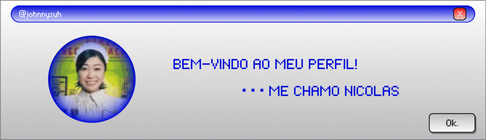

#  Olá! 
## Me chamo Nicolas Cabral Duarte...

### ...tenho 17 anos e estou no terceiro ano do ensino médio, sou estudante de Técnico em Desenvolvimento de Sistemas no SESI SENAI.
‎ 

‎ 
##  Linguagens
   

## Ferramentas

 

‎ 

##  Redes sociais

  <a href="https://instagram.com/nic0lazsz" target="_blank"> 
   <a href="https://tiktok.com/@nicolasss10000" target="_blank"> 
    <a href="https://www.last.fm/pt/user/kibumxcx" target="_blank"> 
     <a href="https://letterboxd.com/fayewongo" target="_blank"> 
     <a href="https://www.duolingo.com/profile/nicolasss1000000" target="_blank"> 
     <a href="https://open.spotify.com/user/nicolascabrald" target="_blank"> 

‎ 

 

